# Design Patterns GoF em Java — com UML

Esta apostila apresenta os principais padrões de projeto (*Design Patterns*) do catálogo **GoF (Gang of Four)**, com exemplos práticos em **Java** e diagramas **UML (Mermaid)**.

---

## 🏗️ 1. Padrões de Criação

### 1.1 Singleton

Garante que uma classe tenha apenas **uma instância** e fornece um ponto global de acesso a ela.


```java
public class Configuracao {
    private static Configuracao instancia;
    private Configuracao() {}

    public static Configuracao getInstancia() {
        if (instancia == null) {
            instancia = new Configuracao();
        }
        return instancia;
    }
}

public class Main {
    public static void main(String[] args) {
        Configuracao c1 = Configuracao.getInstancia();
        Configuracao c2 = Configuracao.getInstancia();
        System.out.println(c1 == c2); // true
    }
}
```

---

### 1.2 Factory Method

Define uma **interface para criar objetos**, mas permite que as subclasses decidam **qual classe instanciar**.


```java
abstract class Transporte {
    public abstract Veiculo criarVeiculo();
}

class TransporteTerrestre extends Transporte {
    public Veiculo criarVeiculo() {
        return new Carro();
    }
}

interface Veiculo {
    void mover();
}

class Carro implements Veiculo {
    public void mover() {
        System.out.println("Dirigindo um carro...");
    }
}

public class Main {
    public static void main(String[] args) {
        Transporte transporte = new TransporteTerrestre();
        Veiculo v = transporte.criarVeiculo();
        v.mover();
    }
}
```

---

## 🧩 2. Padrões Estruturais

### 2.1 Adapter

Permite que classes com **interfaces incompatíveis** trabalhem juntas.


```java
interface Tomada2Pinos {
    void conectar();
}

class TomadaAntiga implements Tomada2Pinos {
    public void conectar() {
        System.out.println("Conectado na tomada de 2 pinos.");
    }
}

interface Tomada3Pinos {
    void conectar3();
}

class AdaptadorTomada implements Tomada3Pinos {
    private Tomada2Pinos tomada2;
    public AdaptadorTomada(Tomada2Pinos tomada2) {
        this.tomada2 = tomada2;
    }
    public void conectar3() {
        tomada2.conectar();
        System.out.println("Adaptador converteu para 3 pinos.");
    }
}

public class Main {
    public static void main(String[] args) {
        TomadaAntiga tomadaAntiga = new TomadaAntiga();
        Tomada3Pinos adaptador = new AdaptadorTomada(tomadaAntiga);
        adaptador.conectar3();
    }
}
```

---

### 2.2 Decorator

Permite **adicionar responsabilidades** a objetos dinamicamente, sem alterar sua estrutura.


```java
interface Cafe {
    double custo();
}

class CafeSimples implements Cafe {
    public double custo() { return 5.0; }
}

class LeiteDecorator implements Cafe {
    private Cafe cafe;
    public LeiteDecorator(Cafe cafe) { this.cafe = cafe; }
    public double custo() { return cafe.custo() + 2.0; }
}

public class Main {
    public static void main(String[] args) {
        Cafe cafe = new CafeSimples();
        cafe = new LeiteDecorator(cafe);
        System.out.println("Custo total: R$ " + cafe.custo());
    }
}
```

---

## 🧠 3. Padrões Comportamentais

### 3.1 Observer

Define uma **dependência um-para-muitos** entre objetos, de modo que, quando um objeto muda de estado, todos os seus dependentes são notificados.

```mermaid
classDiagram
    class Observador {
      <<interface>>
      +atualizar(msg String)
    }

    class Usuario {
      -String nome
      +atualizar(msg String)
    }

    class Sujeito {
      -List~Observador~ observadores
      +adicionar(o Observador)
      +notificar(msg String)
    }

    Observador <|.. Usuario
    Sujeito "1" o--> "many" Observador : mantém
```



```java
import java.util.ArrayList;
import java.util.List;

interface Observador {
    void atualizar(String mensagem);
}

class Sujeito {
    private List<Observador> observadores = new ArrayList<>();

    public void adicionar(Observador o) { observadores.add(o); }

    public void notificar(String mensagem) {
        for (Observador o : observadores)
            o.atualizar(mensagem);
    }
}

class Usuario implements Observador {
    private String nome;
    public Usuario(String nome) { this.nome = nome; }
    public void atualizar(String mensagem) {
        System.out.println(nome + " recebeu: " + mensagem);
    }
}

public class Main {
    public static void main(String[] args) {
        Sujeito chat = new Sujeito();
        chat.adicionar(new Usuario("Ana"));
        chat.adicionar(new Usuario("Bruno"));
        chat.notificar("Nova mensagem no grupo!");
    }
}
```

---

### 3.2 Strategy

Permite definir uma **família de algoritmos**, encapsulá-los e torná-los **intercambiáveis**.


```java
interface EstrategiaPagamento {
    void pagar(double valor);
}

class CartaoCredito implements EstrategiaPagamento {
    public void pagar(double valor) {
        System.out.println("Pagando R$" + valor + " com cartão de crédito.");
    }
}

class PayPal implements EstrategiaPagamento {
    public void pagar(double valor) {
        System.out.println("Pagando R$" + valor + " com PayPal.");
    }
}

class Carrinho {
    private EstrategiaPagamento estrategia;
    public void setEstrategia(EstrategiaPagamento estrategia) {
        this.estrategia = estrategia;
    }
    public void pagar(double valor) {
        estrategia.pagar(valor);
    }
}

public class Main {
    public static void main(String[] args) {
        Carrinho c = new Carrinho();
        c.setEstrategia(new CartaoCredito());
        c.pagar(50);
        c.setEstrategia(new PayPal());
        c.pagar(75);
    }
}
```

---

## 📘 Conclusão

Os **Design Patterns GoF** são soluções testadas e amplamente utilizadas para problemas recorrentes no desenvolvimento de software orientado a objetos.  
Dominar esses padrões melhora a **legibilidade**, **manutenção** e **extensibilidade** do código.
